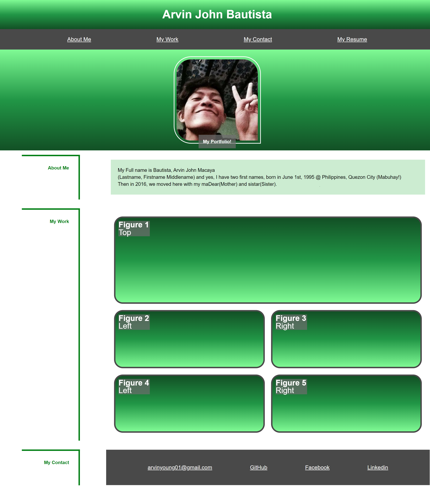

## 02 Advanced CSS: Portfolio
https://github.com/irvinek01/Homework2-Professional-Portfolio
https://irvinek01.github.io/Homework2-Professional-Portfolio/

## Description
A Web-based portfolio, A display of my works/projects that I'm part of, to showcase my skills and talents to employers looking to fill a part-time or full-time position. Features a responsive UI that depends on device screens (Phone, Tablet, Monitor Wide)

## Usage
Clickable display of works will go to the deployed URL.
